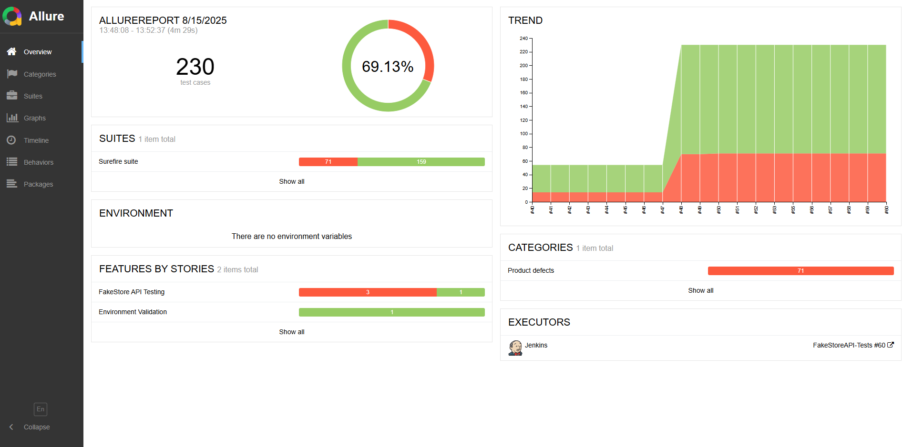

# FakeStore API Test Automation with Jenkins CI/CD

A complete automation testing project demonstrating CI/CD integration using Jenkins, REST Assured, and GitHub Pages for report hosting.


## 📋 Project Overview

This project showcases automated API testing for the [FakeStore API](https://fakestoreapi.com/) with a complete CI/CD pipeline using Jenkins. Tests run automatically on code commits and generate beautiful reports hosted on GitHub Pages.

##  Objectives Achieved

✅ **CI/CD Integration** - Automated test execution on code changes  
✅ **Jenkins Pipeline** - Declarative pipeline with Docker agent  
✅ **API Testing** - REST Assured framework for comprehensive API tests  
✅ **Report Generation** - Allure reports with GitHub Pages hosting  
✅ **Notifications** - Slack and email alerts for build status  
✅ **Webhooks** - Automatic triggering on GitHub push events

## 🛠️ Technologies Used

- **Testing Framework**: REST Assured + TestNG
- **Build Tool**: Maven
- **CI/CD**: Jenkins with Docker
- **Reports**: Allure Framework
- **Hosting**: GitHub Pages
- **Notifications**: Slack + Email
- **Version Control**: Git + GitHub

## 📁 Project Structure

```
├── src/
│   └── test/
│       └── java/
│           └── com/
│               └── emmanuelarhu/
│                   ├── base/
│                   │   └── BaseTest.java
│                   ├── models/
│                   │   ├── Cart.java
│                   │   ├── CartItem.java
│                   │   ├── LoginRequest.java
│                   │   ├── Product.java
│                   │   └── User.java
│                   ├── tests/
│                   │   ├── AuthApiTest.java
│                   │   ├── CartsApiTest.java
│                   │   ├── ConnectivityTest.java
│                   │   ├── ProductsApiTest.java
│                   │   └── UsersApiTest.java
│                   └── utils/
│                       ├── AuthTestDataProvider.java
│                       ├── CartTestDataProvider.java
│                       ├── ProductTestDataProvider.java
│                       └── TestDataProvider.java
├── target/
│   ├── allure-results/
│   └── surefire-reports/
├── Dockerfile
├── Jenkinsfile
├── pom.xml
├── testng.xml
└── README.md
```

## Quick Start

### Prerequisites
- Java 17+
- Maven 3.8+
- Docker (optional)
- Jenkins (local or Docker)

### Local Testing
```bash
# Clone the repository
git clone https://github.com/emmanuelarhu/Jenkins_FakeStoreApiTest.git
cd Jenkins_FakeStoreApiTest

# Run tests
mvn clean test

# View results
open target/surefire-reports/index.html
```

### Docker Testing
```bash
# Build and run in Docker
docker build -t fakestore-tests .
docker run fakestore-tests
```

## 🔧 Jenkins Setup

### 1. Install Required Plugins
- Git Plugin
- Pipeline Plugin
- HTML Publisher Plugin
- Allure Plugin
- Slack Notification Plugin
- Email Extension Plugin

### 2. Configure Jenkins Job
1. Create new **Pipeline** job
2. Set **SCM** to this GitHub repository
3. Configure **Webhooks** for automatic triggering
4. Set **Jenkinsfile** path: `Jenkinsfile`

### 3. Environment Variables
Configure these in Jenkins:
- `SLACK_CHANNEL`: Your Slack channel (e.g., `#testing`)
- `EMAIL_TO`: Your email address
- GitHub credentials for Pages deployment


## 📊 Test Reports

### Live Reports
🌐 **GitHub Pages**: [Click me  to open 👉 Allure Report](https://emmanuelarhu.github.io/Jenkins_FakeStoreApiTest/allure-report/)



### Report Features
- **Test Execution Summary** - Pass/fail statistics
- **Test Details** - Individual test results and timings
- **API Response Data** - Request/response information
- **Trend Analysis** - Historical test data
- **Mobile Friendly** - Responsive design for all devices

## 🧪 Test Suite

The project includes comprehensive API testing for FakeStore API with organized test classes:

### Test Classes Overview

| Test Class | Purpose | Coverage |
|------------|---------|----------|
| **BaseTest** |  Test foundation | Common setup, configurations |
| **ConnectivityTest** |  API connectivity | Basic endpoint availability |
| **ProductsApiTest** |  Product operations | CRUD operations, search, categories |
| **CartsApiTest** |  Shopping cart | Cart management, items |
| **UsersApiTest** |  User management | User CRUD, authentication |
| **AuthApiTest** |  Authentication | Login, tokens, security |

### Test Data Management

| Component | Description |
|-----------|-------------|
| **TestDataProvider** |  Base data provider for all tests |
| **ProductTestDataProvider** |  Product-specific test data |
| **CartTestDataProvider** |  Cart and item test data |
| **AuthTestDataProvider** |  Authentication test data |

### Model Classes

| Model | Purpose |
|-------|---------|
| **Product** |  Product entity representation |
| **Cart** |  Shopping cart model |
| **CartItem** |  Individual cart items |
| **User** |  User profile model |
| **LoginRequest** |  Authentication request model |

### Test Scenarios
- ✅ **API Connectivity** - Basic endpoint availability testing
- ✅ **Product Management** - Complete CRUD operations for products
- ✅ **Shopping Cart Operations** - Cart creation, item management, checkout
- ✅ **User Management** - User registration, profile management, authentication
- ✅ **Authentication & Security** - Login flows, token validation, access control
- ✅ **Response Validation** - JSON schema validation and data integrity
- ✅ **Error Handling** - Invalid requests and edge cases
- ✅ **Performance Testing** - Response time validation across all endpoints


## 🔔 Notifications

### Slack Integration
- ✅ Build success/failure alerts
- ✅ Test execution summaries
- ✅ Direct links to reports and logs

### Email Notifications
- ✅ HTML formatted emails
- ✅ Build status and statistics
- ✅ Quick access links to reports

## 🐳 Docker Support

The project includes Docker support for consistent testing environments:

```dockerfile
FROM maven:3.8.1-openjdk-17-slim
WORKDIR /FakeStoreApiTest
COPY . .
RUN mvn dependency:go-offline
CMD ["mvn", "clean", "test"]
```

## 📈 CI/CD Pipeline

### Pipeline Stages
1. **Checkout** - Pull latest code from GitHub
2. **Setup** - Install dependencies and tools
3. **Test** - Execute API test suite
4. **Report** - Generate Allure HTML reports
5. **Deploy** - Push reports to GitHub Pages
6. **Notify** - Send status notifications

### Triggering
- **Automatic**: GitHub webhook on push to `main` branch
- **Manual**: Jenkins "Build Now" button
- **Scheduled**: Can be configured for nightly runs

## Project Benefits

- **Quality Assurance** - Automated testing catches issues early
- **Rapid Feedback** - Instant notifications on build status
- **Professional Reports** - Stakeholder-friendly test results
- **Scalable Architecture** - Easy to add more tests and endpoints
- **Best Practices** - Follows industry CI/CD standards

## 🤝 Contributing

1. Fork the repository
2. Create a feature branch (`git checkout -b feature/new-test`)
3. Commit changes (`git commit -m 'Add new API test'`)
4. Push to branch (`git push origin feature/new-test`)
5. Open a Pull Request

## 📝 License

This project is licensed under the MIT License - see the [LICENSE](LICENSE) file for details.

## 👨‍💻 Author

**Emmanuel Arhu**
- 🌐 Website: [emmanuelarhu.link](https://emmanuelarhu.link)
- 💼 LinkedIn: [linkedin.com/in/emmanuelarhu](https://www.linkedin.com/in/emmanuelarhu)
-  📧 Email: [emmanuelarhu706@gmail.com](mailto:emmanuelarhu706@gmail.com)

## 🙏 Acknowledgments

- [FakeStore API](https://fakestoreapi.com/) for providing the test API
- [Allure Framework](https://docs.qameta.io/allure/) for beautiful reporting
- [REST Assured](https://rest-assured.io/) for API testing capabilities
- [Jenkins](https://www.jenkins.io/) for CI/CD automation

---

⭐ **Star this repository if it helped you learn CI/CD with Jenkins!** ⭐